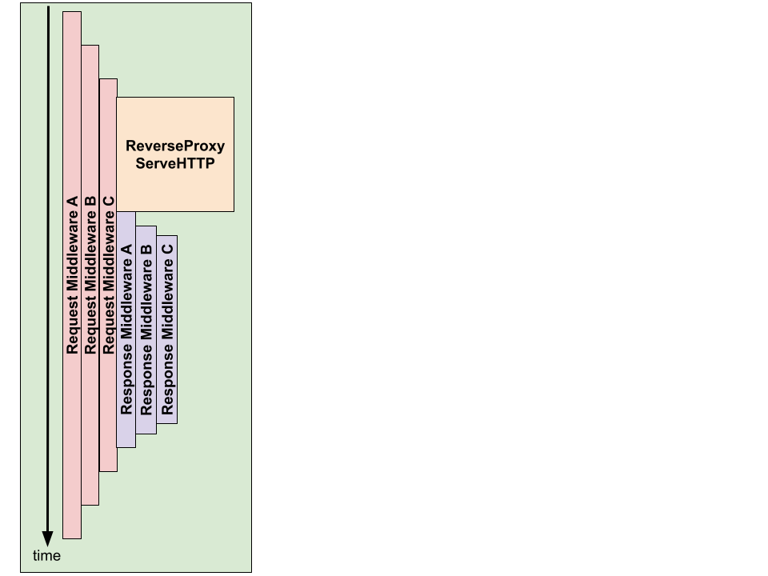

# sni-reverse-proxy

[](https://goreportcard.com/report/github.com/adrianosela/sni-reverse-proxy)
[](https://godoc.org/github.com/adrianosela/sni-reverse-proxy)
[](https://github.com/adrianosela/sni-reverse-proxy/issues)
[](https://github.com/adrianosela/sni-reverse-proxy/blob/master/LICENSE)

Pure Go SNI-based HTTP reverse proxy.

### Example

```
func main() {
	rp := proxy.New().
		// do nothing with requests for now (same as the default behavior)
		WithRequestMiddleware(reqmw.NewDoNothingRequestMiddleware()).
		// do nothing with responses for now (same as the default behavior)
		WithResponseMiddleware(respmw.NewDoNothingResponseMiddleware()).
		// store hosts configuration in-memory (same as the default behavior)
		WithHostManager(hostmgr.NewInMemoryHostManager()).
		// using file-system certificate manager with test certs directory
		WithCertificateManager(certmgr.NewFileSystemCertificateManager(
			"./_test_certs_/%s-cert.pem",
			"./_test_certs_/%s-key.pem",
		))

	// add target hosts to proxy
	for sni, target := range map[string]string{
		"backend_a.adrianosela.com": "http://localhost:8085",
		"backend_b.adrianosela.com": "http://localhost:8086",
		"backend_c.adrianosela.com": "http://localhost:8087",
	} {
		if err := rp.AddHost(sni, target); err != nil {
			log.Fatalf("failed to add proxy target host: %s", err)
		}
	}

	// start the proxy server
	if err := rp.ListenAndServeTLS(":8443"); err != nil {
		log.Fatalf("failed to listen and serve TLS: %s", err)
	}
}
```

### Middleware Timing Diagram

There are two types of middlewares supported -- **request middlewares**, and **response middlewares**. The major difference between these is their scope.

- Both request middlewares and response middlewares are hirarchical in-order
- Response middlewares **all** run **after** request proxying (e.g. getting a response from the upstream host for a request) and can modify the response.
- Request middlewares are all **started** before request proxying -- allowing the developer to modify requests. However, the scope of any given request middleware includes lower order request middlewares, request proxying, and all response middlewares -- allowing the developer to **also** modify responses, record timing, etc.



### Testing

#### To Verify Connection to a Back-end Host

Using `cURL`'s "resolve" feature to resolve one of the hostnames that our mock program has a certificate for to localhost:

```
curl --insecure --resolve backend_a.adrianosela.com:8443:127.0.0.1 https://backend_a.adrianosela.com:8443
```

> Note: alternatively, you can change your machine's `/etc/hosts` file to point the back-end hostnames to localhost:
e.g.

> ```
> ##
> # Host Database
> #
> # localhost is used to configure the loopback interface
> # when the system is booting.  Do not change this entry.
> ##
> 127.0.0.1       localhost
> 255.255.255.255 broadcasthost
> ::1             localhost
>
> 127.0.0.1       backend_a.adrianosela.com
> 127.0.0.1       backend_b.adrianosela.com
> ```
> and use your favorite HTTP(S) client.

#### To view the served certificate for a given SNI:

```
openssl s_client -connect backend_a.adrianosela.com:8443 -servername backend_b.adrianosela.com
```
